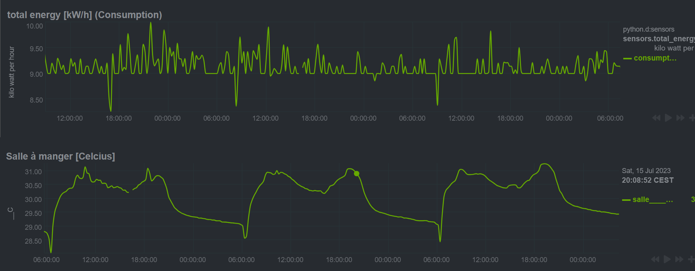

# Node-RED library for Aragon2

## Summary
1. [Broadcast a spoken message](broadcast)
1. [LogView - Automatic logging and presentation of DataPoints](logview)
1. [Powerful and easy-to-use scheduling in Node-RED](scheduler)
1. [ASR NLU Test - useful for debugging](asr-nlu-test)
1. [EnOcean Devices - control EnOcean lights](enocean-devices)
1. [EnOcean sensors samples](enocean-sensors-samples)
1. [FutureShape sensfloor with Voice Dialog](sensfloor-dialog)
2. [Trigger Voice Dialog with any Events](trigger-voice-dialog)
3. [Using customized Keywords for Commands and Voice Messages](custom-voice-commands)
1. [Shelly WiFi button](shelly-button)
1. [Function-GPT](function-gpt)
1. [Timed Voice Prompt - Medication Reminder](timed-voice-prompts)

## Sample screenshots

