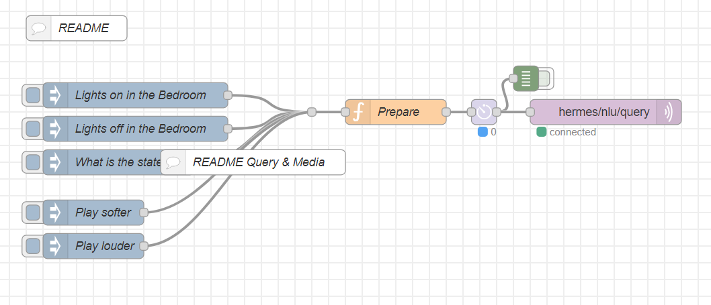

# ASR & NLU Test

This flow showcases the process of injecting a voice command (in the form of a string) to be processed by the ASR and NLU components, and then executed.

## Explanations:
- Download, import the flow (asr-nlu-test.json) and save in Node-RED
- Adapt the payload in the "Lights on in the Bedroom" to your installation, save and select the inject button.
- Expected result: the command will be parsed and executed
- Hint: Follow the execution in the Watch window