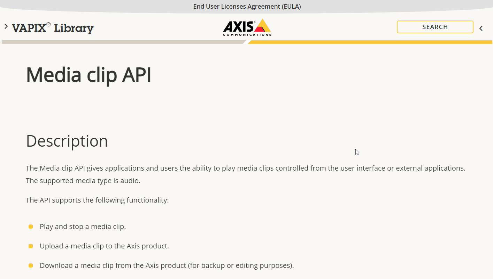

## Copy all audio to AXIS speaker
This flow will send a copy of audio messages (any Aragon siteId) to the Axis speaker.
If you want to play only a specific siteId, see below.
**Configuration** is required: open the "Prepare command to upload and play" and set:
- IP of Axis speaker
- Username and passwword

## AXIS resources and links (change to your IP)
1. [Media-clip API](https://www.axis.com/vapix-library/subjects/t10100065/section/t10036045/display)
1. [Media clips](http://192.168.1.14/audio/index.html#/audio/clips)
1. [Accounts](http://192.168.1.14/audio/index.html#/system/accounts)
1. [Volume](http://192.168.1.14/audio/index.html#/audio/device-settings/device-0)

## Code to play only a specific siteId 
// Example msg.topic: "hermes/audioServer/Kitchen/playBytes/70c9fad9-ac73-408b-a092-8fee9b1bf3ee"
// 1. Split the topic by '/' and get the third parameter
var topicParts = msg.topic.split('/');
var thirdParam = topicParts[2]; // Assuming the topic has at least three parts

// Check if the third parameter is 'kitchen', case insensitive
if (thirdParam.toLowerCase() !== 'kitchen') {
    // If it's not 'kitchen', log an error and stop processing
    node.error("Topic does not contain 'kitchen'", msg);
    return null; // Stop the execution and return nothing
}

// If it is 'kitchen', continue processing
return msg; // Pass the message to the next node