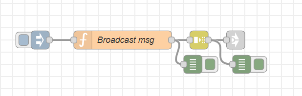

# Broadcast a spoken message

This flow will let you broadcast a spoken message on all Satellites

## Explanations:
- Download, import the flow (broadcast.json) and save in Node-RED
- Click the inject button, the preconfigured "Okay, I will call for help." message will be spoken on all Satellites.