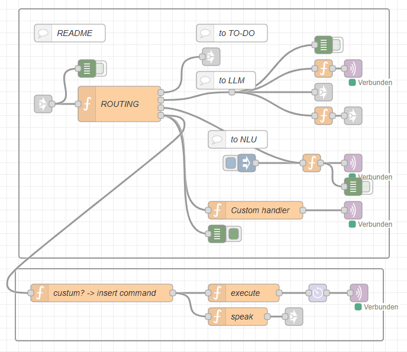

# Custom-Voice-Command

This flow allows you to create your own, user-specific words that are understood by the system within any sentence and then trigger actions and/or output a voice message.
In principle, this is also possible with KNX scenes. With scenes, however, the exact name of the scene must be spoken. Here, on the other hand, it is sufficient if the defined keyword appears in the sentence.

## Explanations:

1. define the keyword in the ‘ROUTING’ node under ‘// CUSTOM KEYWORDS (all languages)’.
1. edit the ‘custom?...’ node to determine whether the keyword exists
1. specify the command to be executed in the ‘execute’ node. If it is a command that ARAGON understands and executes, it can be entered here in this wording. Please note that the room name where the command is to be executed must also be specified for command execution.
