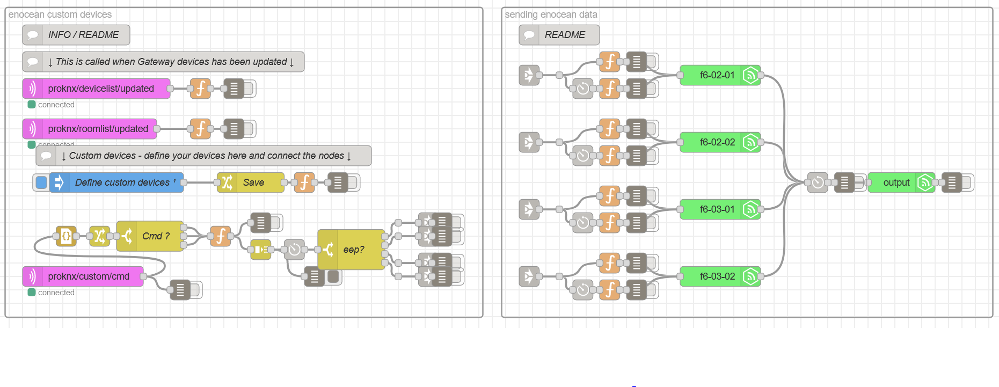

# EnOcean Devices

The EnOcean Devices flow demonstrates the integration of EnOcean devices with Aragon voice control.

## Explanations:
This flow is designed to facilitate the control of EnOcean devices and their integration with Aragon voice control. It allows users to receive EnOcean RF frames from sensors that have been configured within the system. Additionally, the flow enables the simulation of switches to activate various devices, such as lighting systems. This integration showcases the seamless interaction between EnOcean devices and Aragon voice control, providing a convenient and efficient solution for managing smart home environments.