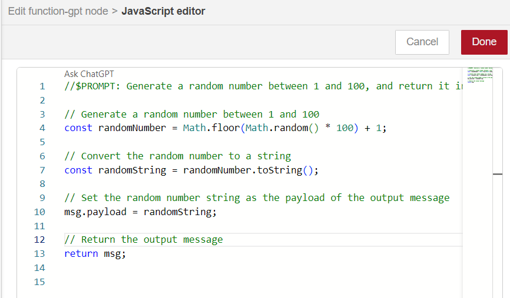

# Function-GPT

This flow demonstrates how you can have Artificial Intelligence to assist you in writing code.

## Explanations:

The @flowforge/node-red-function-gpt is a variation of the standard Node-RED function node.
It includes an interface to ChatGPT for writing into the function content.

Requirements
1. Upgrade Node-RED to version 3.1, see Aragon Master 'About | Show/Hide System Update'
2. Aragon Master version: 1.4.24 or better
3. Having 'Set the Node-RED password' after upgrade 1.4.24. 
    (-> this setp enables the new 'Monaco' code editor which is a requirement)
4. Install @flowforge/node-red-function-gpt from the Palette
5. Follow instructions https://flows.nodered.org/node/@flowforge/node-red-function-gpt

At the time of writing, one step is missing: You can find the OpenAI 'Organization ID' 
under OpenAI Manage Account | Organization | settings (the API key is under User | Settings)

This flow demonstrates these two prompts
1. Generate a random number between 1 and 100, and return it in msg.payload as a string
2. if input msg.payload is a string, write "This is a string" followed by the value of msg.payload in the debug window. If the msg.payload is an object, write the 'value' in the debug window. Finally, msg.payload is any other type, generate a warning on the debug window