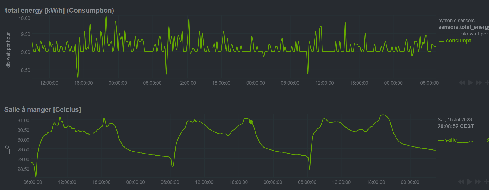

# LogView - Atomatic logging and presentation of DataPoints

The LogView automatically log any datapoint tagged with '#l', and generates corresponding charts
This version of the LogView is a Proof-of-concept and only works with the proServ Gateway. 
PM dev@proknx.com if you're interested in other gateways.

## Explanations:
- in ETS, tag relevant datapoints with '#l' (that is add #l at the end of the name)
- download and import the netdata.json flow (it will be added as NETDATA tab)
- install Netdata from Node-RED
- Wait a few minutes
- Open dashboard, two views are available:
   1.  <code>http://IP-MASTER:19999//#menu_sensors</code> System & Sensors in Netdata dashboard
   2.  <code>http://IP-MASTER:19999/sensors.html</code> Sensors Netdata dashboard (sensors only)
