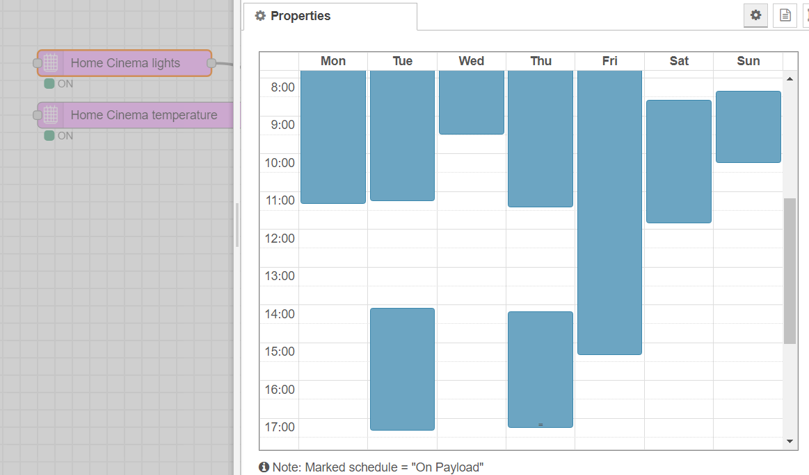
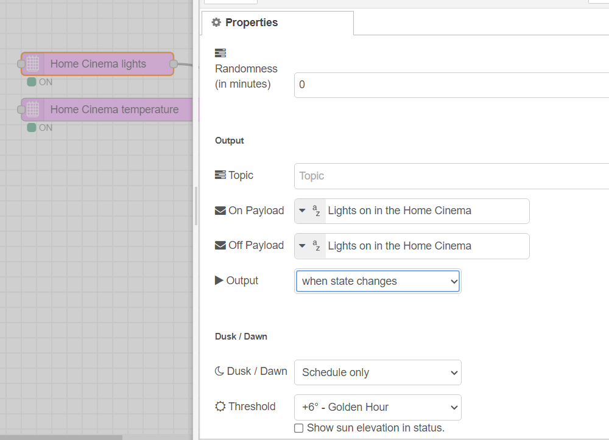
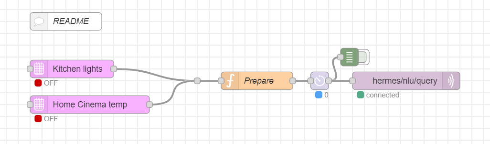

# Powerful and easy-to-use scheduling in Node-RED

This flow demonstrates the process of injecting a voice command (in the form of a string) at a predetermined time or based on the position of the sun.

## Explanations:
-Mark the 'ON' time in the calendar, anything not marked in blue is 'OFF'
-Type a command in the 'ON'  text box (use a command that you already know works by voice) Example "Turn on the Living room lights"
-Type a command in the 'OFF' text box, for example "Set the temperature of the Living room to 18 degrees"

Instead of time, it is possible to use Dusk and Dawn as triggers as well
Any command that works by voice, can be used. That is not only lights, airconditioning shutters but also media control or... Good morning Superscene

