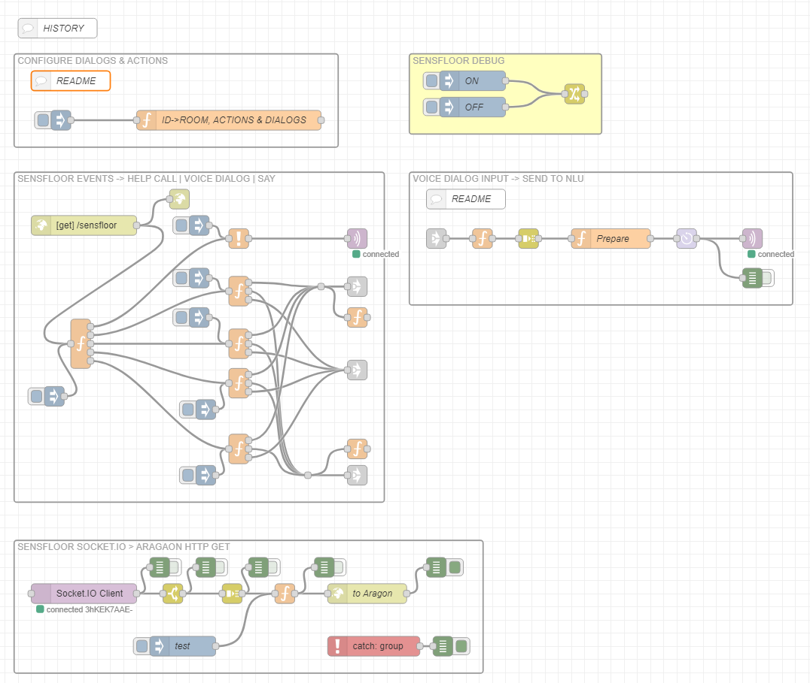

# Future-Shape's SensFloor technology with Aragon Voice Dialog

This flow demonstrates how to integrate Futurshape's SensFloor technology with Aragon Voice Dialog.

# Overview
The code snippet provided is written in JavaScript and is used to configure voice dialog and actions for different events from the SensFloor. The code uses the flow object to set the actions, dialog, and say messages for each room.

# Configuration
To configure the voice dialog and actions, follow these steps:
 1. Open the "DEFINE ACTIONS & DIALOGS" node and
 1. Set the flow siteId variable to the name of the room you want to configure.
 1. set the `ID`_action variable to an array of actions to be performed when someone enters the room.
 1. Set the `ID`_dialog variable to null if you want the system to say something without starting a voice dialog when someone enters the room. Otherwise, set it to an object containing the following properties:
    - siteId: The name of the room.
    - textQuery: The text to be spoken to ask the user a question.
    - textConfirm: The text to be spoken when the user confirms the action.
    - textCancel: The text to be spoken when the user cancels the action.
    - defaultAction: The default action to be taken if the user does not respond, either 'cancel, 'confirm' or empty.
    - id: A unique identifier for the dialog.
1. If the dialog is not configured in the previous step, Set the `ID`_say variable to the message you want the system to say when someone enters the room.
1. Repeat the steps for each event `ID` and for both entering and leaving the room/bed.

# Example
Here is an example of how to configure the voice dialog and actions for a room:
In the first example the `ID` equals room_in. It is configured to launch say message (i.e. no dialog).
In the second example the `ID` equals room_out. It is configured to for a dialog (i.e. no say)

`var siteId = "Living Room 1";`

`/************** ROOM IN *********************/`
`flow.set("room_in_action", ["turn on the bedroom lights","turn on the bathroom lights"]);`
`flow.set("room_in_dialog", null); // Say something, don't start a voice dialog`
`flow.set("room_in_say", "welcome");`

`/************* ROOM OUT **********************/`
`flow.set("room_out_action", ["turn off the lights in the " + siteId]);`
`flow.set("room_out_dialog", {`
`    "siteId": siteId,`
`    "textQuery": "Would you like me to turn off the lights?",`
`    "textConfirm": "OK, turning off the lights!",`
`    "textCancel": "I won't change the lights.",`
`    "defaultAction": "Cancel",`
`    "id": "room_out"`
`});`
`flow.set("room_out_say", null);`

In this example, the code sets the `siteId` variable to "Living Room 1". It then sets the actions, dialog, and say messages for when someone enters and leaves the room. When someone enters the room, the system will turn on the bedroom and bathroom lights and say "welcome". When someone leaves the room, the system will ask the user if they want to turn off the lights. If the user confirms, the system will turn off the lights and say "OK, turning off the lights!". If the user cancels, the system will say "I won't change the lights.".

# Conclusion
This documentation has explained how to configure voice dialog and actions using the provided code snippet. By following the steps outlined in this documentation, you can easily configure voice dialog and actions for different rooms.
