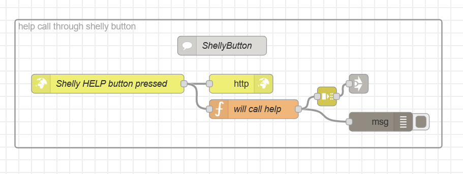

# Shelly Button

This guide illustrates the process of integrating the Shelly WiFi Button and demonstrates how to handle button click events. The Shelly Button is a battery-operated device that can send commands to control other devices over the internet. To set up the Shelly Button 1, you need to connect to its Wi-Fi access point using a mobile device and configure it using the Shelly App or the default IP address. Once configured, you can define different actions for different types of button presses, such as triggering webhooks or URLs.

## Explanations:
