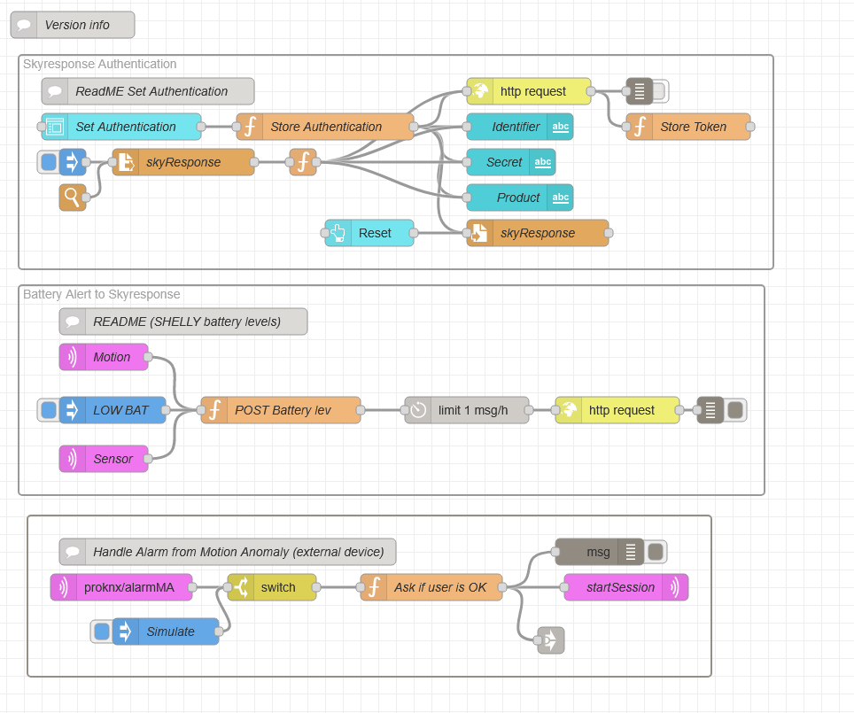

# Skyresponse

This flow demonstrates how to intergrate Aragon with the Skyresponse alarm handling platform.
Skyresponse is a Swedish technology company that provides alarm and event handling management, primarily in Personal Care and Smart Building Services. It offers a 100% cloud-based alarm management platform used by large international care and security organizations in the public and private sectors. The platform is designed to ensure that events and alarms always reach the right person, at the right time, and with the right information. Skyresponse's products include Skyresponse Central, which provides complete alarm handling for operation and response centers in Technology-enabled care and Smart building services (Facility management).

## Explanations:
