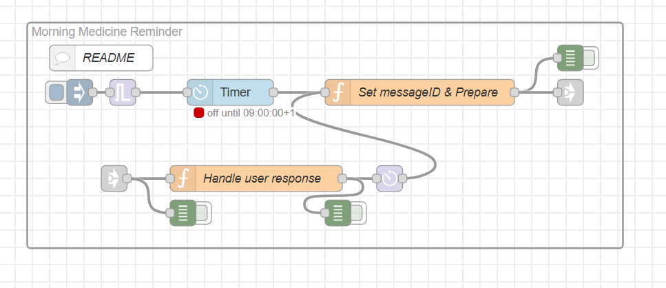

# Medication Reminder with Aragon Voice Dialog

This flow demonstrates how to Aragon Voice Dialog to create an Medication Reminder

# Summary
The Morning Medecine reminder applications demonstrates how to configure a timed voice prompt.
When the timer event is triggered, the user is asked "Did you take your medicine this morning?"
If the user replies 'yes', the system responds "OK, good!".
If the user replies 'no' or nothing, the system responds "Please take your morning pills now!",

# Configuration
 1. Set the siteId and the messageId in the 'Set messageID & Prepare' node. Note that the messageId must be unique.
 1. Set the timer: set the ON timer, the OFF timer shall be set to ON +5 sec
