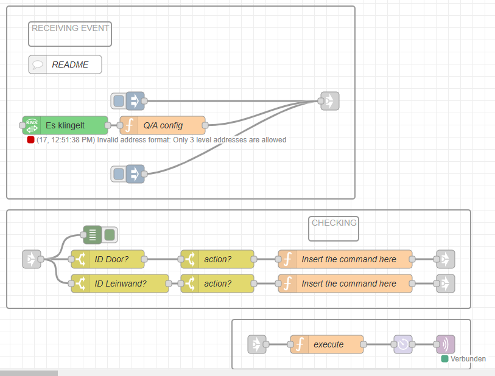

# Trigger Voice Dialog

This is a helpful flow to draw the user's attention to events and immediately ask a question that may be answered with ‘Yes’ or ‘No’. 

There are many typical use cases for older people who can be proactively guided with the questions in their daily lives.
e.g. when going to bed: ‘Would you like to switch off the light?’

When leaving the kitchen: ‘Should I switch off the oven?’

When recognising a fall: ‘Should I call for help?’

## Explanations:

.....
